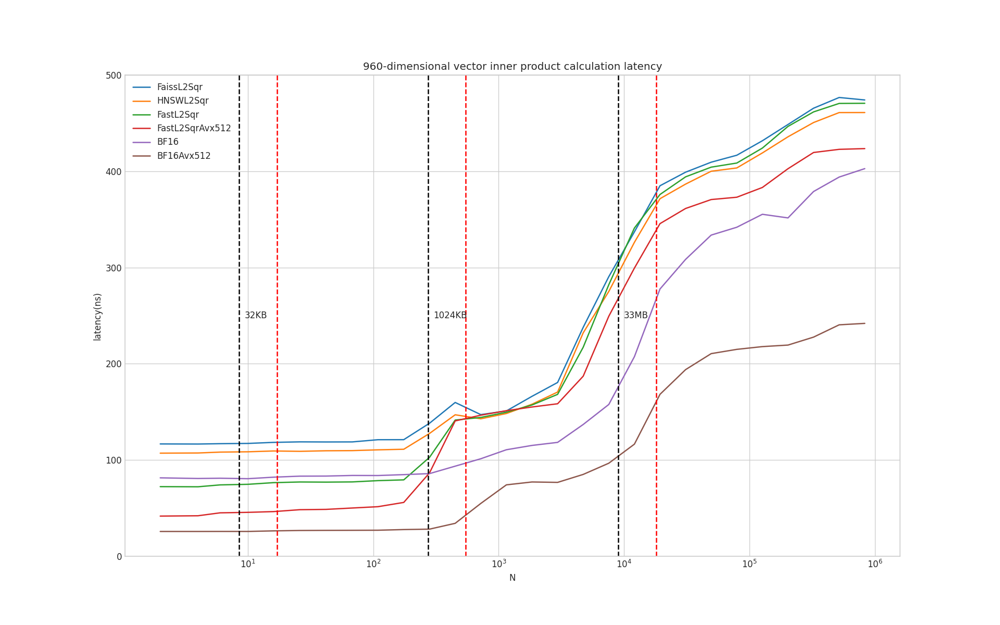

# Faster L2 Squared Distance

This repo contains an implementation of L2 squared distance computation that is faster than [Faiss](https://github.com/facebookresearch/faiss) and [hnswlib](https://github.com/nmslib/hnswlib) using AVX2 instructions

The main codes are in [simd.cc](https://github.com/hhy3/Faster-L2Sqr/blob/main/simd.cc) and you can experiment with [bench.ipynb](https://github.com/hhy3/Faster-L2Sqr/blob/main/bench.ipynb)

With [gcc](https://gcc.gnu.org/) and [google benchmark](https://github.com/google/benchmark), you can compile `simd.cc` with
```
g++ -O3 -march=native simd.cc -o simd -std=c++20 -lbenchmark_main -lbenchmark -lpthread
```




## Testing enviroment
* **CPU**: AMD Ryzen 9 5900HX 3.30GHz/4.60GHz
  * L1$: 8 x 32KB, 8-Way, 64 byte lines
  * L2$: 8 x 512KB, 8-Way, 64 byte lines
  * L3$: 16MB, 16-Way, 64 byte lines
* **RAM**: 16GB DDR4 3200MHz
* **Compiler**: g++ 10.3.0
* **OS**: 5.10.16.3-microsoft-standard-WSL2
